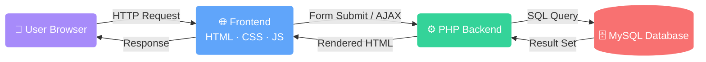

<a name="readme-top"></a>


<div align="center">


<br/>

<p>
  
  
  
  
</p>

<br/>

<table>
  <tr>
    <td align="center"><a href="#-overview"><kbd>📌 Overview</kbd></a></td>
    <td align="center"><a href="#-key-features"><kbd>✨ Features</kbd></a></td>
    <td align="center"><a href="#%EF%B8%8F-tech-stack"><kbd>🛠️ Tech Stack</kbd></a></td>
    <td align="center"><a href="#%EF%B8%8F-installation"><kbd>⚙️ Installation</kbd></a></td>
    <td align="center"><a href="#-user-roles"><kbd>👥 User Roles</kbd></a></td>
    <td align="center"><a href="#-contributing"><kbd>🤝 Contributing</kbd></a></td>
  </tr>
</table>

</div>

<br/>

---

## 📌 Overview


**Website Store Marketplace** is a full-featured e-commerce web platform built with **PHP** and **MySQL**, designed for simplicity and scalability.

> 🏪 **Sellers** — Register, build a store, and manage every product with ease.<br/>
> 🛍️ **Buyers** — Discover products, add to cart, checkout, and track all transactions.<br/>
> 🛡️ **Admins** — Oversee the entire marketplace, manage sellers, and keep the platform healthy.

<br/>

### 💡 Why This Project?

- ✅ Clean role-based access control for 3 user types
- ✅ Real-time product search by name or seller
- ✅ Complete transaction history for buyers & sellers
- ✅ Lightweight stack — no framework needed, pure PHP
- ✅ Easy to deploy on any local or shared hosting server

<br/>

---

## ✨ Key Features

<br/>

<div align="center">

```
╔══════════════════════════════════════════════════════════════════════╗
║                     🌟  PLATFORM FEATURES  🌟                       ║
╠══════════════════════════════════════════════════════════════════════╣
║  🔐  Seller Auth        │  Secure login + full CRUD on products      ║
║  🛡️  Admin Panel        │  Monitor & manage seller accounts          ║
║  🔍  Smart Search       │  Find by product name or seller instantly  ║
║  🛒  Shopping Cart      │  Add, review, and checkout items           ║
║  📋  Transaction Log    │  Full history for buyers & sellers         ║
║  🔑  Role-Based Auth    │  3-tier access: Admin · Seller · Buyer     ║
╚══════════════════════════════════════════════════════════════════════╝
```

</div>

<br/>

<div align="center">
<table>
  <tr>
    <th width="33%">👤 Buyer Experience</th>
    <th width="33%">🏪 Seller Tools</th>
    <th width="33%">🛡️ Admin Power</th>
  </tr>
  <tr>
    <td>
      🔍 Search products<br/>
      🛒 Manage cart<br/>
      💳 Checkout smoothly<br/>
      📋 View transaction history
    </td>
    <td>
      ➕ Add new products<br/>
      ✏️ Edit product details<br/>
      🗑️ Delete listings<br/>
      📦 View incoming orders
    </td>
    <td>
      👁️ Monitor all sellers<br/>
      ✅ Activate accounts<br/>
      🚫 Suspend accounts<br/>
      📊 Oversee platform
    </td>
  </tr>
</table>
</div>

<br/>

---

## 🛠️ Tech Stack

<br/>

<div align="center">


<br/><br/>



</div>

<br/>

---

## ⚙️ Installation

<br/>

> [!IMPORTANT]
> Make sure all prerequisites are installed before proceeding.

<div align="center">

| Requirement | Version | Download |
|:---:|:---:|:---:|
|  | `>= 7.4` | [php.net](https://www.php.net/downloads) |
|  | `>= 5.7` | [mysql.com](https://dev.mysql.com/downloads/) |
|  | Latest | [apachefriends.org](https://www.apachefriends.org/) |

</div>

<br/>

### 🚀 Quick Start

<details>
<summary><b>📋 Step 1 — Clone the Repository</b></summary>
<br/>

```bash
git clone https://github.com/your-username/website-store-marketplace.git
cd website-store-marketplace
```

</details>

<details>
<summary><b>📁 Step 2 — Move to Server Directory</b></summary>
<br/>

```bash
# Windows (XAMPP)
move website-store-marketplace C:\xampp\htdocs\

# Linux / macOS (XAMPP)
mv website-store-marketplace/ /opt/lampp/htdocs/
```

</details>

<details>
<summary><b>🗄️ Step 3 — Setup Database</b></summary>
<br/>

```
1. Start Apache & MySQL from XAMPP Control Panel
2. Open → http://localhost/phpmyadmin
3. Create new database → marketplace_db
4. Click Import → Choose file → database/marketplace_db.sql
5. Click Go ✅
```

</details>

<details>
<summary><b>🔧 Step 4 — Configure Connection</b></summary>
<br/>

```php
// config/db.php
$host     = 'localhost';
$db_name  = 'marketplace_db';
$username = 'root';
$password = '';
```

</details>

<details>
<summary><b>🌐 Step 5 — Launch the App</b></summary>
<br/>

Open your browser and navigate to:
```
http://localhost/website-store-marketplace/
```

🎉 **You're all set!**

</details>

<br/>

---

## 👥 User Roles

<br/>

<div align="center">

```
                    ┌─────────────────────────────┐
                    │     🛒 MARKETPLACE ROLES     │
                    └─────────────────────────────┘

        ┌──────────────┐   ┌──────────────┐   ┌──────────────┐
        │  👤  BUYER   │   │ 🏪  SELLER   │   │ 🛡️  ADMIN    │
        │──────────────│   │──────────────│   │──────────────│
        │ Browse Store │   │ Add Products │   │ View Sellers │
        │ Search Items │   │ Edit Listing │   │  Activate    │
        │   Add Cart   │   │ Delete Items │   │   Suspend    │
        │   Checkout   │   │ View Orders  │   │   Monitor    │
        │  Trx History │   │ Trx History  │   │  All Data    │
        └──────────────┘   └──────────────┘   └──────────────┘
          [Public]           [Authenticated]      [Super Access]
```

</div>

<br/>

---

## 🤝 Contributing

Contributions, issues, and feature requests are welcome!

<div align="center">

| Step | Command |
|:---:|:---|
| 1️⃣ Fork | Click the **Fork** button at the top right |
| 2️⃣ Branch | `git checkout -b feature/your-feature` |
| 3️⃣ Commit | `git commit -m "feat: your feature description"` |
| 4️⃣ Push | `git push origin feature/your-feature` |
| 5️⃣ PR | Open a **Pull Request** and describe your changes |

</div>

<br/>

---

## 📄 License

Distributed under the **MIT License**. See [`LICENSE`](LICENSE) for more information.

---

<div align="center">

<br/>

### 🙌 Thank You for Visiting!

<br/>

**If you find this project useful, please consider giving it a ⭐**<br/>
It motivates and helps others discover this project!

<br/>

[](https://github.com/your-username/website-store-marketplace)
[](https://github.com/your-username/website-store-marketplace/fork)

<!-- <br/> -->

<!-- Made with ❤️ &nbsp;by &nbsp;**[Your Name](https://github.com/your-username)** -->

<br/>

<a href="#readme-top">
  
</a>

</div>

